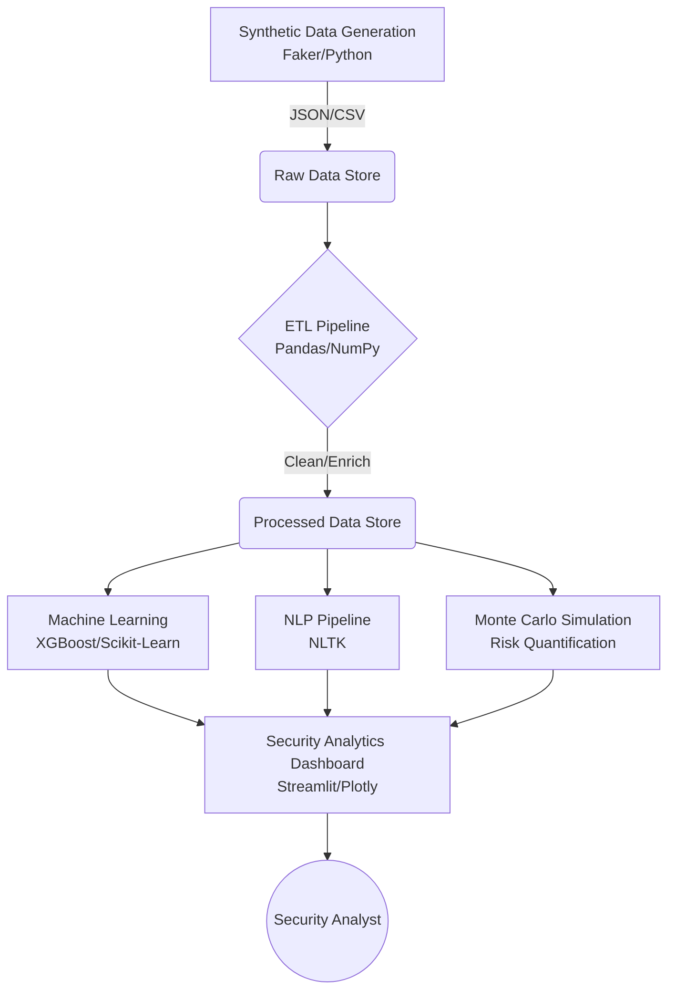

# e-Government Portal Attack and Citizen-Data Protection Analytics

[](https://opensource.org/licenses/MIT)
[](https://www.python.org/downloads/)

**Course:** SAS821S Security Analytics, NUST, Semester 2, 2026  
**Topic:** T09  
**Team:** 
- Wilhelm Kangwiya (218113846) - Data & Modelling Lead
- Linus Shivute (220121613) - Security Engineering & Intelligence Lead

## Problem Statement
The digital transformation of public services relies heavily on e-Government portals to deliver critical citizen services. However, these platforms have increasingly become prime targets for state-sponsored and financially motivated cyber threats. High-volume attacks such as credential stuffing, sophisticated API scraping, SQL injection, and subtle logic abuse pose severe risks to the confidentiality and integrity of citizen data. 

This project simulates a comprehensive attack landscape on an e-Government portal, implementing an end-to-end Security Analytics Decision-Support System. By leveraging synthetic telemetry across web application firewalls (WAF), API gateways, database auditing, and unstructured citizen complaints, the platform applies advanced machine learning, incident timeline reconstruction, Monte Carlo risk simulation, and NLP to detect, investigate, and quantify threats. 

The ultimate goal is to provide a unified analytics engine that empowers security operations centers (SOC) to swiftly mitigate attacks and protect sensitive citizen information while remaining compliant with data privacy frameworks.

## Architecture



## Technical Components
- **Session 1 (Data Generation):** Synthetic dataset creation mimicking WAF, API, DB, and complaint data.
- **Session 2 (ETL Pipeline):** Data extraction, cleaning, transformation, and normalization.
- **Session 3 (Feature Engineering):** Generating ML-ready features like request rates and geographic velocity.
- **Session 4 (Supervised Learning):** Training an XGBoost classifier for attack detection.
- **Session 5 (Unsupervised Learning):** Anomaly detection via Isolation Forest for novel threats.
- **Session 6 (NLP Analytics):** Mining citizen complaints to identify emergent threats/issues.
- **Session 7 (Incident Timeline):** Reconstructing cross-dataset entity behavior mapping.
- **Session 8 (Simulation & Risk):** Monte Carlo simulation for financial/data exposure risk.
- **Session 9 (Threat Intelligence):** Incorporating STIX2 formats for intelligence sharing.
- **Session 10 (Dashboarding):** Consolidating all analytics into an interactive Streamlit UI.

## Dataset Overview

| Dataset | Target Count | Actual Generated | Key Fields |
|---------|--------------|------------------|------------|
| `web_waf_logs.csv` | ~6,000 | 8,313 | `src_ip`, `http_method`, `url_path`, `waf_action`, `attack_type` |
| `api_gateway_logs.csv` | ~4,000 | 6,680 | `src_ip`, `endpoint`, `citizen_id`, `request_payload_bytes` |
| `auth_db_audit_logs.csv` | ~3,500 | 3,170 | `citizen_id`, `auth_event`, `db_query`, `is_impossible_travel` |
| `citizen_complaints.json` | ~300 | 201 | `citizen_id`, `complaint_text`, `urgency_level`, `category` |
| **Total** | **~13,800** | **18,364** | **Exceeds course minimum of 5,000 records** |

## Installation & Setup

1. **Clone repository:**
   ```bash
   git clone https://github.com/linusx7/SAS821S_T09_eGov_Portal_Protection.git
   cd SAS821S_T09_eGov_Portal_Protection
   ```
2. **Create virtual environment:**
   ```bash
   python -m venv venv
   # On Windows: venv\Scripts\activate
   # On Mac/Linux: source venv/bin/activate
   ```
3. **Install requirements:**
   ```bash
   pip install -r requirements.txt
   ```
4. **Download NLTK data:**
   ```bash
   python -c "import nltk; nltk.download('punkt'); nltk.download('stopwords'); nltk.download('wordnet'); nltk.download('punkt_tab')"
   ```
5. **Generate synthetic data:**
   ```bash
   python -m src.data_generation.generate_synthetic_data
   ```
6. **Run ETL pipeline:**
   ```bash
   python -m src.pipelines.etl_pipeline
   ```
7. **Train supervised ML model (Random Forest / XGBoost):**
   ```bash
   python -m src.models.supervised_detector
   ```
8. **Run UEBA & unsupervised anomaly detection (Isolation Forest / Impossible Travel):**
   ```bash
   python -m src.models.ueba_anomaly_detector
   ```
9. **Run adversarial robustness evaluation:**
   ```bash
   python -m src.models.adversarial_evaluator
   ```
10. **Build incident timeline & correlation engine:**
    ```bash
    python -m src.intelligence.correlation_engine
    ```
11. **Generate STIX 2.1 threat intelligence bundle:**
    ```bash
    python -m src.intelligence.stix_threat_intel
    ```
12. **Run NLP citizen complaint mining:**
    ```bash
    python -m src.intelligence.nlp_ticket_miner
    ```
13. **Run Monte Carlo security control simulation:**
    ```bash
    python -m src.simulation.monte_carlo_simulator
    ```
14. **Launch decision-support dashboard:**
    ```bash
    streamlit run app/streamlit_app.py
    ```

## Project Structure

```text
SAS821S_T09_eGov_Portal_Protection/
├── app/                  # Streamlit dashboard application
├── data/                 # Raw and processed data (ignored in version control)
│   ├── raw/
│   ├── processed/
│   └── data_dictionary.md
├── docs/                 # Documentation and playbooks
│   └── playbooks/
├── models/               # Serialized ML models (*.pkl)
├── notebooks/            # Jupyter notebooks for EDA and prototyping
├── src/                  # Core Python modules
│   ├── data_generation/  # Synthetic data generation scripts
│   ├── pipelines/        # ETL and processing pipelines
│   ├── models/           # ML model training scripts
│   ├── analysis/         # NLP and Simulation scripts
│   └── utils/            # Helper functions
├── requirements.txt      # Python dependencies
├── .gitignore            # Git ignore file
└── README.md             # Project overview (this file)
```

## Technical Specifications Compliance
| Requirement | Addressed By |
|-------------|--------------|
| **C1** Python Environment | `requirements.txt`, setup instructions |
| **C2** Data Processing | `src/pipelines/etl_pipeline.py` |
| **C3** Exploratory Analysis | Streamlit Dashboard & Notebooks |
| **C4** ML Implementation | `src/models/supervised_detector.py` |
| **C5** Real-world Scenario | E-Government Portal Attack simulation |
| **C6** Project Artifacts | Dashboard, Models, Reports |
| **C7** Documentation | README, `data_dictionary.md`, inline docs |
| **C8** Modularity | OOP design, decoupled `src/` packages |
| **C9** Version Control | Git workflow |
| **C10** Reproducibility | Fixed random seeds (`SEED = 42`), pinned versions |

## Repository
https://github.com/linusx7/SAS821S_T09_eGov_Portal_Protection

## License
MIT

## Acknowledgements
- Namibia University of Science and Technology (NUST)
- SAS821S Facilitator
